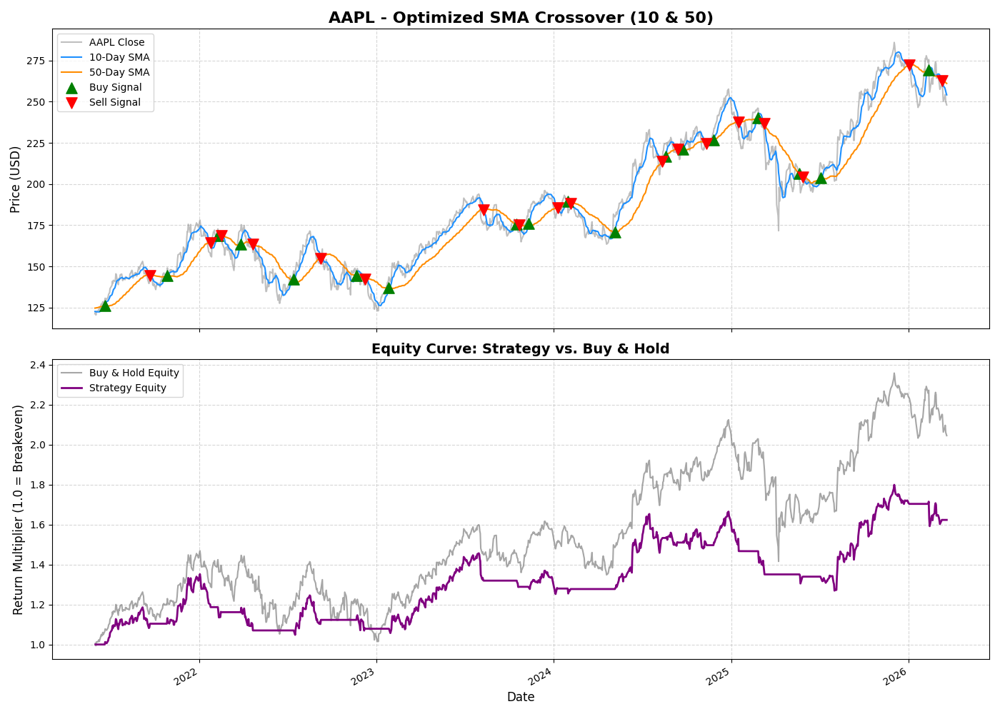
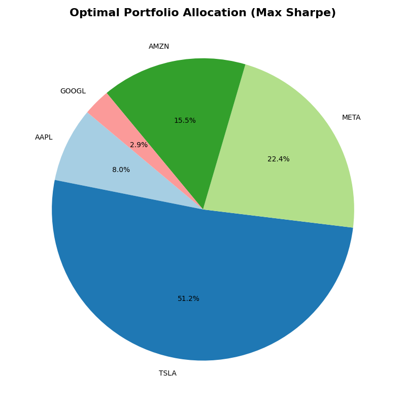

# GenAI & Algorithmic Trading

Welcome to the **GenAI & Algorithmic Trading** repository! This project explores various quantitative finance concepts, blending traditional algorithmic trading strategies with modern machine learning and generative AI techniques.

## Features & Modules

To separate concerns and keep the codebase organized, the project is divided into distinct modular subfolders:

### 1. `ml_models/` (Machine Learning & AI)

- **`lstm.py`**: Implementation of Long Short-Term Memory (LSTM) recurrent neural networks for forecasting time-series market data.
- **`linearRegression.py`**: Baseline linear regression models to identify trends and predict future asset price movements.
- **`sentiment.py`**: Sentiment analysis workflows to extract market sentiment signals using Generative AI / NLP, potentially parsing news or social media data.

### 2. `strategies/` (Traditional Quantitative Logic)

- **`emasma.py`**: Exponential Moving Average (EMA) and Simple Moving Average (SMA) crossover strategies.
- **`sma_crossover_optimize.py`**: Backtesting and hyperparameter optimization for SMA crossover strategies to find the most profitable timeframes.

### 3. `portfolio/` (Optimization & Risk Management)

- **`portfolio_optimize_sharpe.py`**: Modern Portfolio Theory (MPT) implementation to find the optimum asset allocation that maximizes the Sharpe ratio (risk-adjusted returns).

### 4. `execution/` (Live Data & Integration)

- **`realtime.py`**: Modules for handling live market data feeds and real-time execution logic.
- **`yfinance/`**: Submodule/local integration of the popular `yfinance` library for robust extraction of historical and real-time market data directly from Yahoo Finance.

## 🛠️ Setup & Installation

1. **Clone the repository:**

   ```bash
   git clone https://github.com/yourusername/genAI-algo-trading.git
   cd genAI-algo-trading
   ```

2. **Create a virtual environment (recommended):**

   ```bash
   python -m venv .venv
   source .venv/bin/activate  # On Windows: .venv\Scripts\activate
   ```

3. **Install dependencies:**
   _(Ensure you have your requirements ready, particularly `pandas`, `numpy`, `scikit-learn`, `tensorflow`/`pytorch`, etc.)_
   ```bash
   pip install -r requirements.txt
   ```
   _(If you are setting up `yfinance` locally from the provided directory, you can run `pip install -e ./yfinance`)_

## Visualizations & Learnings

Here is a glimpse into what the repo code can produce, along with some key takeaways validating the tools.

### Optimized SMA Crossover Strategy



> **Learning Insight: Why did the strategy underperform Buy & Hold?**
>
> If you look closely at the top chart and compare it to the bottom chart, you can see exactly where the strategy bleeds money:
>
> 1. **Whipsawing in Choppy Markets:** Look at the period between mid-2022 and early 2023. Apple's price was bouncing up and down without picking a clear direction. During this time, the short and long moving averages kept crossing back and forth. The strategy was forced to buy, take a small loss, sell, buy again, and take another loss. You can see the purple equity line steadily drop during this time.
> 2. **The "Apple" Factor:** Over the last 5 years, AAPL has been in a massive, historic bull market. Moving average strategies are inherently "lagging." They wait for a trend to be confirmed before buying, meaning they always miss the absolute bottom. When a stock just goes relentlessly up for years, almost no active trading strategy will beat simply holding it.
>
> **Takeaway:** An optimized strategy that looks great in a vacuum might still lose to a passive index fund or simply holding a blue-chip stock!

### Optimal Portfolio Allocation (MPT)

The portfolio optimizer algorithm dynamically shifts weights away from an equal-distribution baseline (Sharpe: 0.77) to a risk-optimized frontier, pushing the system to a **Max Sharpe Ratio of 1.24** (generating an expected ~34% annual return against ~27% volatility).



## Usage

Each script is designed to be run standalone or imported into a larger execution pipeline. For example, to run the LSTM model from its directory:

```bash
python ml_models/lstm.py
```

## ⚠️ Disclaimer

**This software is for educational and research purposes only.** Do not use this code for actual financial trading without thoroughly understanding the risks involved. The authors and contributors are not responsible for any financial losses incurred from using these algorithms or models. Past performance does not guarantee future results.

## Contributing

Contributions, issues, and feature requests are welcome! Feel free to check the issues page.

---

_Enjoy!_
